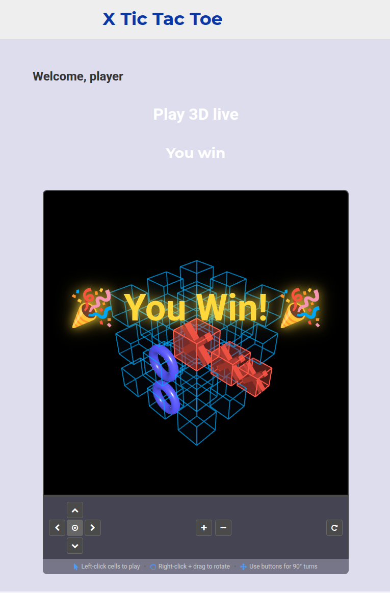

# A simple example of a full multiplayer game web app built with React.js and Node.js stack

A full-featured multiplayer tic-tac-toe game web app built with React.js and Node.js, featuring both classic 2D and immersive 3D cube gameplay.

## ✨ Features

### 🎮 Game Modes
- **2D Classic Mode** - Traditional 3×3 tic-tac-toe grid
- **3D Cube Mode** - Revolutionary 3×3×3 cube with 49 winning combinations!
  - Interactive 3D visualization using Three.js
  - Full camera rotation controls
  - Right-click drag to orbit camera

### 🤖 AI Difficulty Levels
- **Easy** - Random moves, perfect for beginners
- **Medium** - Smart AI that evaluates moves and picks from top 2 options
- **Hard** - Unbeatable AI that always plays optimally

### 🎉 Animations & Visual Effects
- **Win Animation** - Colorful confetti celebration with victory text
- **Loss Animation** - Atmospheric defeat effect

## 🛠️ Tech Stack

Major libraries used on front end:
- react
- webpack
- babel
- react-router
- ampersand
- sass
- jest

Major libraries used on server:
- node.js
- socket.io
- express

### Folder structure:
- **WS** - server side and compiled front end
- **react_ws_src** - React development source and testing

---

### View it online at
https://x-ttt.herokuapp.com/

#### Configurable with external XML file -
https://x-ttt.herokuapp.com/ws_conf.xml

---

##For demonstration purposes only.
